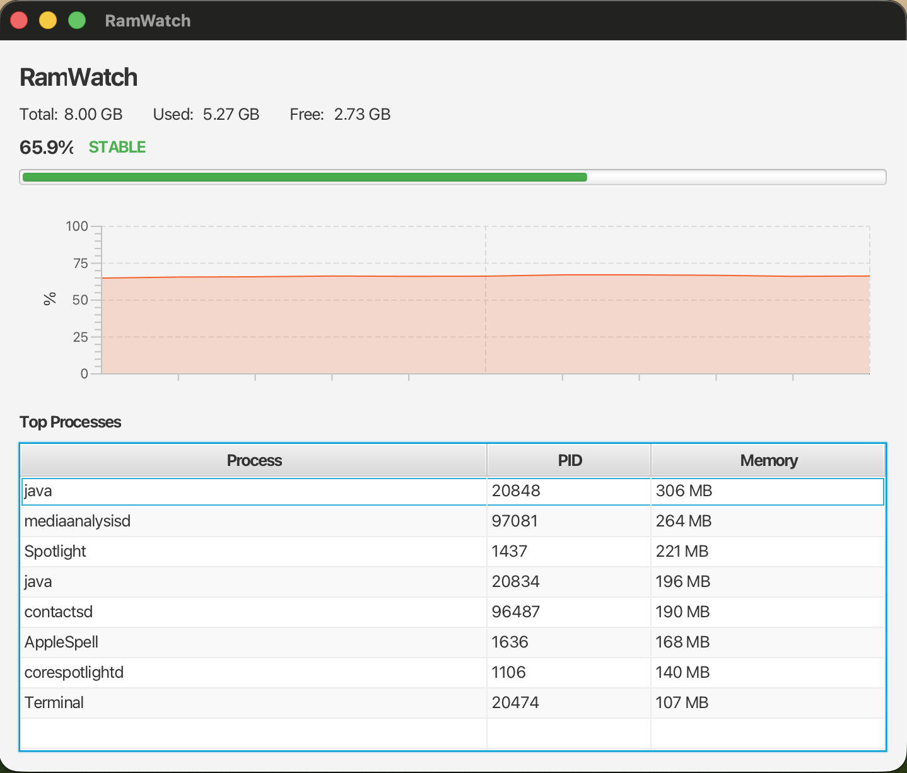

# RamWatch

RamWatch is a lightweight Java desktop utility for real-time RAM monitoring with process tracking and alerts.

The project is designed as a monitoring and diagnostic tool, not as an aggressive RAM booster. Its goal is to show current memory usage, identify top memory-consuming processes, and keep the application itself lightweight enough for machines with moderate resources.

## Tech Stack
- Java 21
- JavaFX
- OSHI
- Maven

## Requirements
- JDK 21 or newer
- Maven 3.9 or newer

## Run
```bash
mvn javafx:run
```

## Screenshot


## Build
```bash
mvn clean package
```

## Test
```bash
# All tests
mvn test

# Single test class
mvn test -Dtest=SystemSamplerTest
```

Maven is configured through `.mvn/maven.config` to store dependencies in `.m2/repository` inside this project. This avoids relying on the default `~/.m2` path.

## Project Structure
- `src/main/java/com/ramwatch/system`: system sampling, OSHI integration, data models and formatting
- `src/main/java/com/ramwatch/analysis`: thresholds, sorting, filtering and state analysis
- `src/main/java/com/ramwatch/ui`: JavaFX screens and controls
- `src/main/java/com/ramwatch/config`: user preferences and defaults
- `src/main/java/com/ramwatch/storage`: local logs and future CSV export

## Current Status
**Phase 0 — complete:** Maven build, Java 21 target, JavaFX and OSHI dependencies, package structure, minimal JavaFX shell.

**Phase 1 — complete:** core monitoring layer.
- `SystemSampler`: reads real RAM and process data from the OS via OSHI and produces a `SystemSnapshot` on each call.
- `MemoryFormatter`: converts raw byte values to human-readable MB/GB strings and formats usage percentages.
- `PollingService`: background thread (min 1 s interval, daemon) that calls `SystemSampler` at a fixed rate and delivers snapshots to a listener; shuts down cleanly on `stop()`.

**Phase 2 — complete:** analysis layer.
- `RamState`: enum `STABLE | WARNING | CRITICAL`.
- `AnalyzedSnapshot`: immutable record with `usedPercent`, `freePercent`, `topConsumers`, `state`, `sampledAt`; ready for direct UI consumption.
- `MemoryAnalyzer`: computes percentages, determines state against configurable thresholds, sorts and filters processes by memory, supports name search. Factory `withDefaults()` (warning < 20% free, critical < 10% free, min 100 MB, top 10).

**Phase 3 — complete:** GUI MVP.
- `DashboardView`: JavaFX layout with RAM summary header (Total / Used / Free), coloured `ProgressBar` (green/yellow/red per state), `AreaChart` history, and sortable process `TableView`.
- `RamChart`: circular buffer (`ArrayDeque`, max 300 samples) feeding a JavaFX `AreaChart`; no unbounded accumulation.
- `DashboardController`: connects `PollingService` → `MemoryAnalyzer` → `DashboardView` via `Platform.runLater()`; starts with `controller.start(intervalSeconds)`, stops cleanly on window close.
