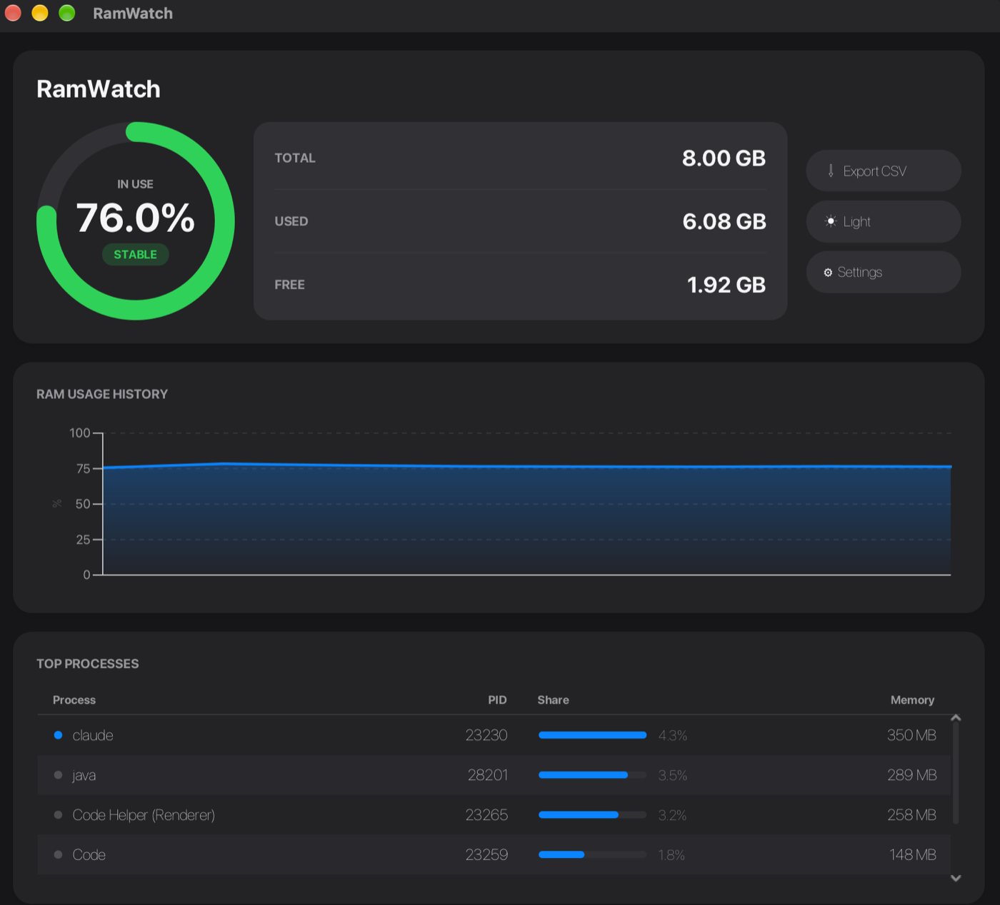

# RamWatch

RamWatch is a lightweight Java desktop utility for real-time RAM monitoring and process
diagnostics.



## The problem

When a machine starts swapping, the questions are always the same: how much memory is
actually in use, which process is holding it, and was it already like this a minute ago.
The tools that answer them tend to sit at two extremes. System monitors show everything at
once and leave the reading to you. "RAM boosters" promise to fix the problem by freeing
memory, which on a modern OS mostly means throwing away caches the system will rebuild.

RamWatch takes the middle position: it answers those three questions and nothing else. It
observes and diagnoses, and never acts on your processes — no killing, no "optimising".
The one thing a monitor must not do is become the problem it is watching, so its own cost
is a design constraint and a measured number rather than a claim (see
[Performance](#performance)).

## Features

- total, used and available RAM, refreshed live, with the used percentage on a ring gauge;
- `STABLE`, `WARNING` and `CRITICAL` states, from configurable free-memory thresholds;
- top-process table with name, PID, memory and share of total RAM, sorted by consumption;
- configurable minimum process size, so small processes stay out of the table;
- RAM history chart over a bounded 300-sample buffer;
- optional event log, written only when the state changes rather than on every cycle, so a
  long session in the same state produces one line and not thousands;
- CSV export of the log for spreadsheets;
- configurable polling interval, never below one second;
- settings dialog with validation, persisted to `~/.ramwatch/config.properties`;
- light and dark themes;
- background polling with clean shutdown when the window closes.

## Tech stack

- Java 21
- JavaFX 21
- OSHI 6.6.5
- Maven
- JUnit 5
- `jpackage` for the macOS bundle

## Requirements

- JDK 21 or newer
- Maven 3.9 or newer

## Build

```bash
mvn clean package
```

This produces `target/ramwatch-0.1.0-SNAPSHOT.jar` plus its runtime dependencies in
`target/lib`. The jar's manifest names `com.ramwatch.Launcher` as the main class and lists
`lib/` on its class path, so the build output is runnable as it stands.

## Run

During development:

```bash
mvn javafx:run
```

From the built jar, with no further arguments:

```bash
java -jar target/ramwatch-0.1.0-SNAPSHOT.jar
```

JavaFX is loaded from the class path rather than the module path, which is why the entry
point is `Launcher` and not `RamWatchApp`: a main class extending `javafx.application.Application`
refuses to start unless JavaFX is a named module. The trade-off is one warning at startup,
`Unsupported JavaFX configuration: classes were loaded from 'unnamed module'`, which is
cosmetic — it is the price of a jar that runs without a `--module-path` argument.

Either way the process is a plain JVM, so macOS labels it "java" in the menu bar and the
dock. The app bundle below is what gives it its own name and icon.

## macOS app bundle

```bash
tools/package-mac.sh          # builds target/dist/RamWatch.app
open target/dist/RamWatch.app
```

The script gathers the jar and its dependencies, renders the icon at every size macOS asks
for, and calls `jpackage --type app-image`. The result is a self-contained `RamWatch.app`
carrying its own Java runtime: it starts under the name RamWatch, with the RamWatch icon,
and needs no JDK installed to run.

### Cross-platform limits

`jpackage` builds only for the platform it runs on: there is no cross-compilation. The
script is macOS-only by construction — it calls `iconutil` and produces an `.app` — and the
project has been packaged and tested on macOS on Apple Silicon only.

The application code itself is portable. JavaFX and OSHI both cover Windows and Linux, and
nothing outside `tools/package-mac.sh` is macOS-specific, so `mvn clean package` and
`java -jar` are expected to work on the other two platforms; they have not been verified
there. Packaging for Windows (`--type msi`, needs WiX) or Linux (`--type deb` or `rpm`)
means running `jpackage` on those systems with an equivalent script and an icon in the
native format (`.ico`, `.png`).

One dependency detail matters when building elsewhere: the JavaFX artifacts are resolved
with a platform classifier (`mac-aarch64` here). Maven picks the classifier from the build
machine, so a build on Windows or Linux pulls the right natives without any change to
`pom.xml` — but the contents of `target/lib`, and therefore any bundle made from it, are
tied to the platform that built them.

## Test

```bash
# All tests
mvn test

# Single test class
mvn test -Dtest=SystemSamplerTest
```

The suite has 112 tests covering the system models, the OSHI sampler, the polling service,
memory analysis and state tracking, the event log and CSV export, configuration persistence
and the table-refresh logic. The tests that exercise OSHI need to write JNA's native library
to a temporary directory, so they fail under a sandbox that forbids it.

Maven is configured through `.mvn/maven.config` to store dependencies in `.m2/repository` inside this project. This avoids relying on the default `~/.m2` path.

## Screenshots

The same dashboard in its light theme:


## Performance

RamWatch is meant to stay open, so its own footprint was measured rather than assumed.
The summary:

| Metric | Result |
|---|---|
| CPU at the 1 s minimum polling interval | 12.6% of one core (~1.6% of an 8-core machine) |
| CPU at 5 s / 30 s polling | 3.8% / 1.2% of one core |
| CPU between polling cycles | 0.0% - the idle UI costs nothing measurable |
| Heap live set (used heap after GC) | 24-43 MB, under the 50 MB target |
| Resident set (RSS) | 260-315 MB, dominated by the JavaFX runtime and the JVM's default heap reservation |

Measured on a MacBook Air (Apple Silicon, 8 cores, 8 GB RAM), macOS 27.0, OpenJDK 25,
on a system with about 680 running processes, using `ps` and `jcmd` over 12 five-second
windows after a 40-second warmup.

The 50 MB target originally applied to RSS. It was missed by five times and redefined as
a target on the application's live set, because the resident set of a JavaFX process is
dominated by fixed costs the application code does not control.

Two optimisations came out of the profiling work: the chart series is now its own
circular buffer (one allocation per cycle instead of about 300), and the process table is
refreshed row by row instead of being rebuilt, which removes 80.9% of cell redraws at 1 s
polling. Neither moves CPU measurably: a cycle is dominated by enumerating every process
on the system, not by drawing. That enumeration remains the real bottleneck.

## Architecture

The data flow is one direction, one cycle at a time:

```text
OSHI → system snapshots → analysis → JavaFX dashboard
                                  ↘ storage (optional event log → CSV)
```

Each layer is a package with one responsibility, and the boundary between them is a set of
immutable records — `MemorySnapshot`, `ProcessSnapshot`, `SystemSnapshot` — that describe a
single polling cycle. Nothing downstream can change what was sampled, and nothing upstream
needs to know who is reading it.

- `src/main/java/com/ramwatch/system`: OSHI integration, sampling, immutable data models and formatting
- `src/main/java/com/ramwatch/analysis`: thresholds, RAM states, process sorting and filtering
- `src/main/java/com/ramwatch/ui`: JavaFX dashboard, gauge, chart, process table, themes and settings dialog
- `src/main/java/com/ramwatch/config`: user preferences, defaults and persistence
- `src/main/java/com/ramwatch/storage`: event log, log reader and CSV export
- `src/test/java`: 112 unit tests across the system, analysis, storage, configuration and UI-logic layers

The separation is what makes the project testable without a display: the analysis, storage
and configuration layers have no JavaFX on their side of the boundary, and even the one
piece of genuinely UI-shaped logic — deciding which table rows changed enough to be worth
redrawing — lives in `ProcessRowDiff`, a class that touches no scene graph and is unit
tested on its own.

## Design notes

**Why JavaFX.** A desktop monitor needs a live chart, a sortable table and a theme that is
not painful to write; JavaFX gives all three in the standard toolchain, with CSS styling
that made the light and dark themes two stylesheets rather than two code paths. The cost is
honest and documented: a JavaFX process carries a few hundred MB of resident set before the
application does anything, which is why the memory target had to be restated on the live
set.

**Why OSHI.** Reading physical memory and per-process usage means native calls, and doing
that by hand per platform is the whole project. OSHI wraps it behind one API, which keeps
`SystemSampler` small enough that the only platform-specific code in the repository is the
macOS packaging script.

**Why controlled polling.** Sampling every process on the machine is the expensive
operation — profiling showed it dominates every cycle — so the interval is a first-class
setting with a hard floor of one second. The floor is enforced in `AppConfig`, not in the
dialog: an invalid configuration cannot be constructed, whether it comes from the UI or
from a hand-edited properties file.

**Efficiency as a constraint, not an afterthought.** The history is a fixed 300-sample
circular buffer that *is* the chart series, so a cycle allocates one point instead of
rebuilding three hundred. The process table is refreshed row by row against what is on
screen, with a one-megabyte visibility threshold taken from the way the values are
formatted — a difference too small to change a single character is a difference not worth
redrawing, and that removes about 80% of cell redraws at one-second polling. Logging is off
by default and, when on, records state transitions rather than samples. None of this is
assumed: the numbers, including the optimisations that turned out not to matter, are in the
[Performance](#performance) section.

## Roadmap

Possible future work, roughly in order of usefulness:

1. Cut the cost of a cycle at its source, by not building an object for every one of the
   machine's processes only to discard most of them in the filter. Profiling identified
   this as the one change that could move the numbers.
2. Windows and Linux packaging, with the equivalent of `tools/package-mac.sh` run on each
   platform.
3. A menu-bar/tray mode, so the app can stay open without a window.
4. Per-process history, to tell a steady consumer from a leak.
5. Configurable chart window, currently fixed at 300 samples.

RamWatch stays focused on lightweight monitoring and diagnosis. Automatic process
termination and aggressive memory "optimisation" are deliberately out of scope: the first
is a decision the user should make themselves, the second mostly discards caches the
operating system is managing better than an application can.
