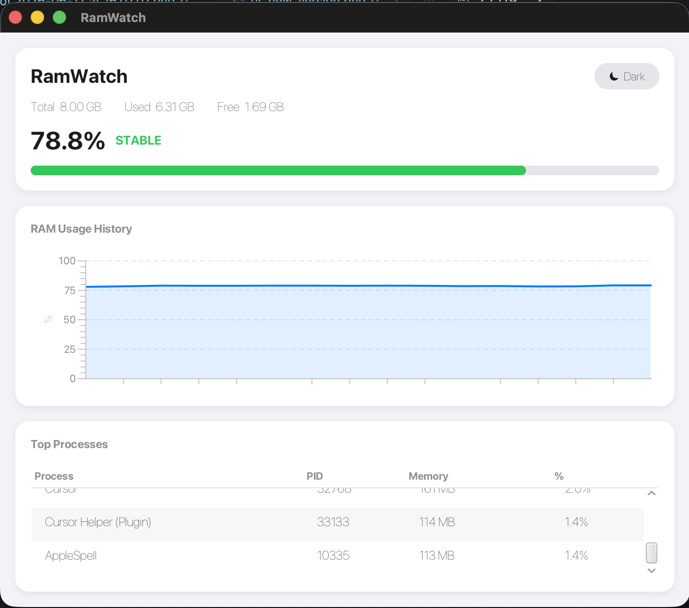

# RamWatch

RamWatch is a lightweight Java desktop utility for real-time RAM monitoring with process tracking and alerts.

The project is designed as a monitoring and diagnostic tool, not as an aggressive RAM booster. Its goal is to show current memory usage, identify top memory-consuming processes, and keep the application itself lightweight enough for machines with moderate resources.

## Tech Stack
- Java 21
- JavaFX
- OSHI
- Maven

## Requirements
- JDK 21 or newer
- Maven 3.9 or newer

## Run
```bash
mvn javafx:run
```

## Screenshot


## Build
```bash
mvn clean package
```

## Test
```bash
# All tests
mvn test

# Single test class
mvn test -Dtest=SystemSamplerTest
```

Maven is configured through `.mvn/maven.config` to store dependencies in `.m2/repository` inside this project. This avoids relying on the default `~/.m2` path.

## Project Structure
- `src/main/java/com/ramwatch/system`: system sampling, OSHI integration, data models and formatting
- `src/main/java/com/ramwatch/analysis`: thresholds, sorting, filtering and state analysis
- `src/main/java/com/ramwatch/ui`: JavaFX screens and controls
- `src/main/java/com/ramwatch/config`: user preferences and defaults
- `src/main/java/com/ramwatch/storage`: local logs and future CSV export
